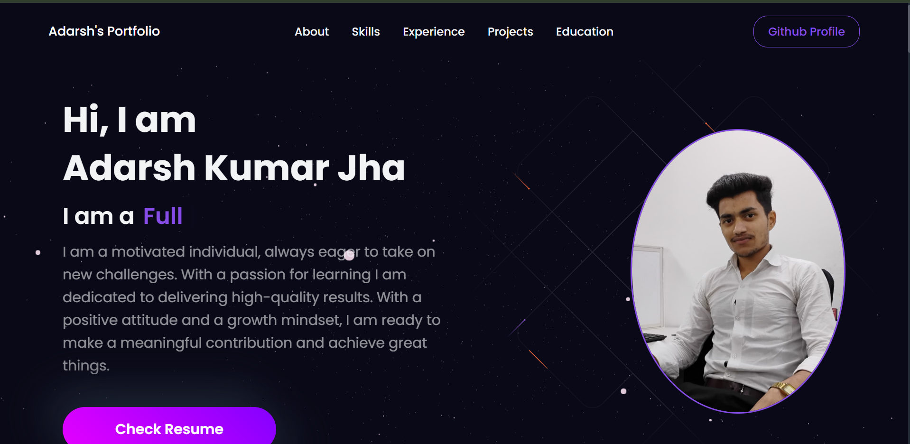

# 🚀 Adarsh's 3D Interactive Portfolio



A modern, highly interactive personal developer portfolio built with React, Three.js, and Vite. The application features stunning 3D models, smooth animations, and a polished user interface.

**Live Demo:** [https://3d-adarshportfolio.vercel.app/](https://3d-adarshportfolio.vercel.app/)

## ✨ Key Features

- **Interactive 3D Elements:** Features dynamic Earth and Stars models using `react-three-fiber` and `Three.js`. Models are Draco-compressed to ensure blazing fast load times.
- **Light & Dark Mode:** A globally managed theme engine allowing users to toggle between crisp light and deep dark visual modes.
- **Progressive Web App (PWA):** Fully installable on mobile and desktop devices with offline caching and native app-like capabilities.
- **Serverless Contact Form:** Integrated with **EmailJS** for direct, backend-free email delivery when visitors reach out.
- **SEO Optimized:** Complete Open Graph and Twitter Card configurations for rich, beautiful link previews when shared on social media.
- **Performance First:** Powered by Vite with `React.lazy` and `Suspense` for aggressive code splitting and optimized chunk loading.

## 🛠️ Technology Stack

- **Frontend Framework:** React 18, Vite
- **3D Graphics:** Three.js, React Three Fiber, React Three Drei
- **Styling:** Styled-Components
- **Email Delivery:** @emailjs/browser
- **PWA Configuration:** vite-plugin-pwa

## 💻 Running Locally

Because this repository separates the architecture, the actual web application code lives inside the `/frontend` directory. 

To run this project locally, simply clone the repository and follow these steps:

```bash
# 1. Navigate into the frontend directory
cd frontend

# 2. Install dependencies
npm install

# 3. Start the development server
npm run dev
```

The application will start immediately, usually accessible at `http://localhost:3000`.

## 📂 Project Structure

```
.
├── frontend/
│   ├── public/         # Static assets (Favicons, 3D Models, PWA Manifest)
│   ├── src/
│   │   ├── components/ # React Components (Navbar, Contact, Canvas Models)
│   │   ├── data/       # Configuration data (constants.js)
│   │   ├── utils/      # Themes (Light/Dark mode)
│   │   ├── App.jsx     # Root Component
│   │   └── index.jsx   # Application Entry Point
│   ├── index.html      # SEO and Metadata Configuration
│   └── vite.config.js  # Vite and PWA settings
└── README.md
```

## 📬 Contact
Created by Adarsh Jha. If you want to get in touch, feel free to use the contact form on the live site!
